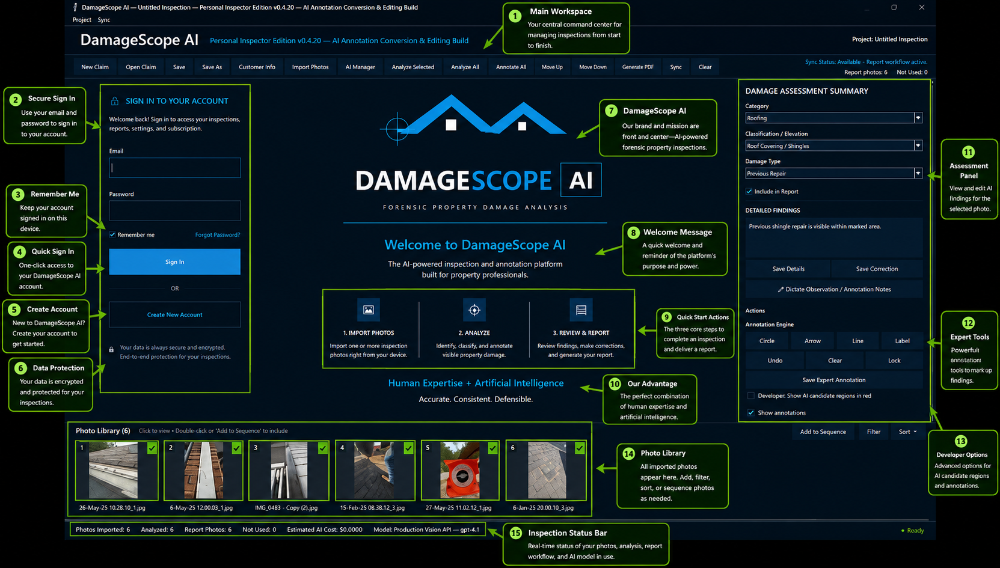
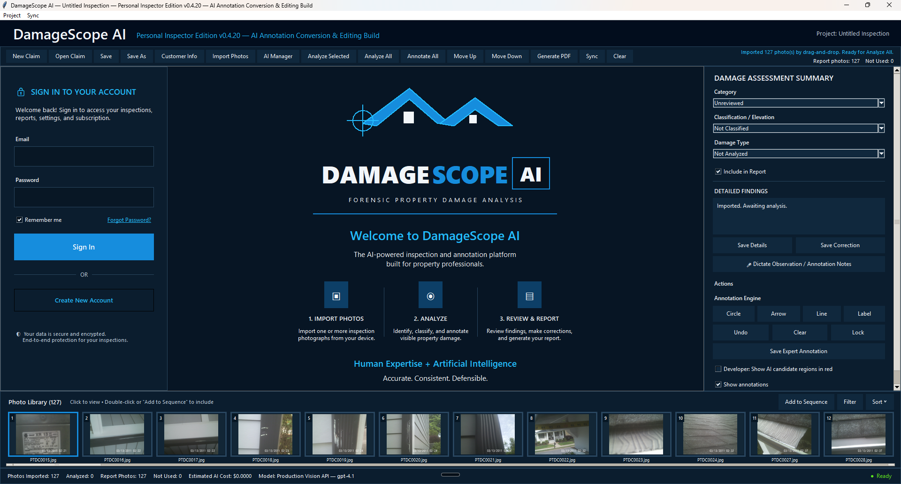
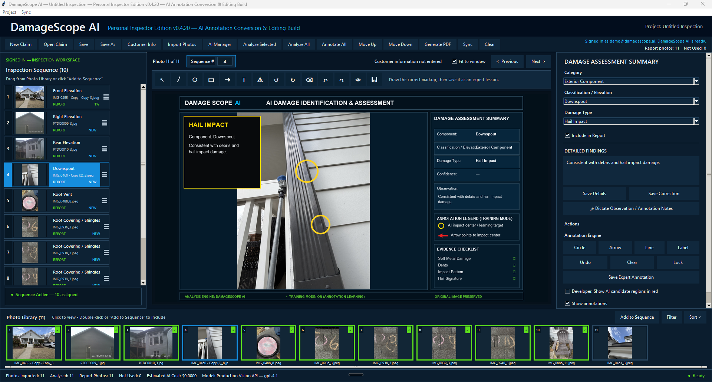
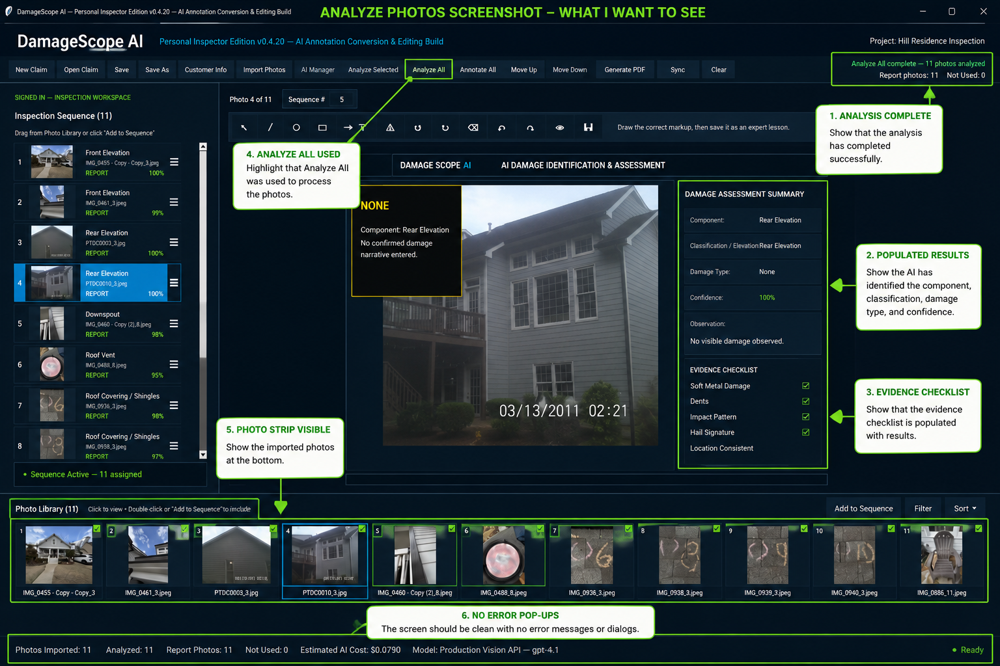
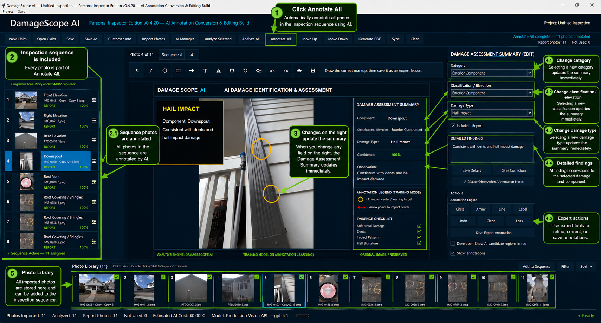
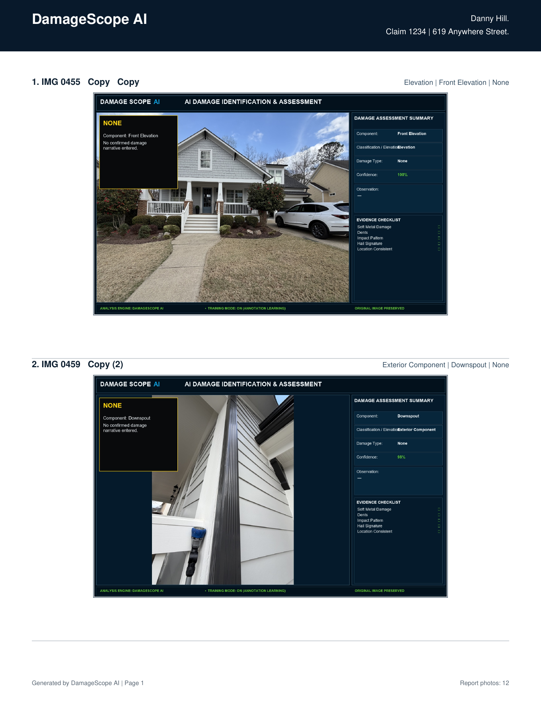

DamageScope AI

AI that understands buildings—not just pictures.

**An AI-assisted forensic building inspection and documentation platform created by an insurance adjuster using OpenAI GPT-5.6 and Codex.**

[](#openai-build-week-2026)
[](#contest-build-status)
[](#system-requirements)
[](#license-and-use)

Overview

DamageScope AI is an AI-assisted forensic building inspection and documentation platform designed to help property professionals collect, organize, analyze, and document property conditions and damage through a structured, evidence-based workflow.

Developed from decades of real-world insurance-adjusting and property-loss experience, DamageScope AI is designed to preserve the relationship between:

* The claim and property
* Inspection areas and building components
* Photographs and annotations
* Observable conditions
* Measurements
* Structured findings
* Expert corrections and approvals
* Supporting evidence
* Final report language

DamageScope AI is not intended to be a generic chatbot or a simple photo-storage application. It is being developed as an evidence-first operating system for forensic property inspections.

The goal is to help professionals create clearer, more consistent, transparent, and defensible documentation while keeping qualified human reviewers in control of final conclusions.

The Problem

Property inspections are often conducted under time pressure and can produce hundreds of photographs, measurements, notes, and observations.

Several recurring problems can weaken an otherwise valid inspection:

* Required photographs may be missed.
* Images may be poorly labeled or disconnected from their locations.
* Building components may be incorrectly identified.
* Measurements and inspection limitations may not be recorded consistently.
* Photos, notes, weather information, findings, and reports may remain in separate systems.
* Professionals may spend hours manually sorting photographs and writing reports.
* Conclusions may be stated without clearly identifying the supporting evidence.
* Corrections from experienced reviewers may be lost instead of improving future performance.

Incomplete or disorganized evidence can create delays, additional inspections, unnecessary disputes, inconsistent reports, and difficulty determining what was actually observed.


 The DamageScope AI Solution

DamageScope AI organizes the inspection around a repeatable chain of evidence:

Claim and Property
        ↓
Inspection Area
        ↓
Building Component
        ↓
Photograph or Measurement
        ↓
Observable Condition
        ↓
Candidate Finding
        ↓
Evidence Review
        ↓
Expert Approval or Correction
        ↓
Final Report
        ↓
Learning Record

The system is designed to help users:

1. Create a structured claim and property record.
2. Capture or import inspection photographs.
3. Organize evidence by inspection step, elevation, room, location, and component.
4. Identify observable building conditions.
5. Create structured, evidence-based findings.
6. Review confidence, limitations, and alternative explanations.
7. Correct or approve AI-assisted results.
8. Generate a professional inspection report.
9. Preserve approved corrections for future evaluations and regression testing.

 Who Uses DamageScope AI?

DamageScope AI is intended for professionals and stakeholders involved in property inspections, damage evaluation, restoration, claims documentation, and evidence review.

Insurance and Claims

* Staff insurance adjusters
* Independent adjusters
* Public adjusters
* Claims managers
* Appraisers
* Umpires
* Loss consultants

Construction and Restoration

* General contractors
* Roofing contractors
* Restoration contractors
* Mitigation companies
* Reconstruction specialists

Inspection and Consulting

* Home inspectors
* Commercial building inspectors
* Building consultants
* Engineers
* Forensic consultants

Property Stakeholders

* Homeowners
* Commercial property owners
* Property managers
* Facility managers

Legal and Risk

* Attorneys
* Expert witnesses
* Risk-management professionals

 Core Features

**Important:** The features demonstrated in the official contest build are identified in the [Contest Build Status](#contest-build-status) section. Planned or partially implemented functions are not represented as complete.

Structured Inspection Workflow

* Create and open property inspections
* Store claim and property information
* Organize the inspection by area, elevation, room, and component
* Record skipped, inaccessible, or incomplete inspection areas
* Preserve a consistent inspection sequence
* Support multiple photographs for an inspection step

Photo and Evidence Management

* Import individual photographs
* Import multiple selected photographs
* Import inspection folders
* Preserve original evidence
* Organize photographs by location and component
* Track review and AI-analysis status
* Retain excluded or low-confidence evidence in an Evidence Vault
* Connect photographs to findings and report language

AI-Assisted Forensic Analysis

* Assist with building-component identification
* Identify visible conditions and potential damage indicators
* Generate structured candidate findings
* Record confidence and uncertainty
* Separate observable facts from causal opinions
* Compare possible explanations
* Reject unsupported conclusions
* Request clarification when the available evidence is insufficient

Evidence-First Forensic Reasoning

DamageScope AI is designed to ask more than:

“What is shown in this image?”

It also asks:

 “What evidence supports each possible conclusion?”

The reasoning workflow is designed to:

1. Identify the building component and location.
2. Record directly observable conditions.
3. Generate multiple plausible candidate findings.
4. Compare each candidate against the available evidence.
5. Identify conflicting or missing evidence.
6. Reject candidates that are not adequately supported.
7. Record confidence and limitations.
8. Present the most defensible finding for expert review.

Structured Findings

A finding may include:

* Building component
* Material
* Location
* Elevation or room
* Observable condition
* Damage type
* Severity
* Confidence
* Cause hypothesis
* Supporting evidence
* Alternative explanations
* Limitations
* Recommended action
* Expert-review status
* Approved report language

Expert Review and Correction

* Review AI-assisted findings
* Approve findings
* Correct inaccurate classifications
* Modify report wording
* Preserve the original prediction
* Record the approved professional outcome
* Maintain a traceable review history

Closed-Loop Learning Architecture

DamageScope AI is designed so expert corrections do not disappear after a review.

The learning process is:

AI Prediction
      ↓
Expert Review
      ↓
Correction or Approval
      ↓
Permanent Learning Record
      ↓
Targeted Evaluation
      ↓
Regression Test
      ↓
Future Verification

This process is intended to help prevent corrected mistakes from silently returning.

Photo Annotation

Supported or planned annotation tools include:

* Arrows
* Circles
* Labels
* Captions
* Measurement markers
* Highlighted regions
* Finding references

Annotations help show exactly which portion of the photograph supports a documented observation.

Quality Control

DamageScope AI is designed to check for:

* Missing required photographs
* Incomplete inspection sequences
* Unsupported findings
* Missing evidence references
* Inconsistent component labels
* Missing confidence information
* Inaccessible areas
* Unresolved expert corrections
* Missing report information
* Findings that require additional review

Immediate Red Alerts

The workflow may stop or escalate when it identifies:

* Potential safety hazards
* Structural instability
* Active water intrusion
* Electrical hazards
* Severe displacement
* Missing critical evidence
* Unsupported causal conclusions
* Insufficient information for a reliable finding

Professional Reporting

DamageScope AI can generate or is being developed to generate reports containing:

* Claim and property information
* Property-verification photographs
* Inspection sequence
* Building-component findings
* Annotated photographs
* Confidence-based findings language
* Measurements
* Inspection limitations
* Inaccessible areas
* Quality-control results
* Expert approvals
* Evidence references

 What Makes DamageScope AI Different?

It Understands the Inspection as a Building Workflow

DamageScope AI is designed around the relationships among building systems, components, locations, photographs, observations, measurements, and findings—not isolated images.

Evidence Comes Before the Conclusion

The platform is designed to preserve the factual basis for each finding and distinguish direct observation from interpretation.

The Professional Remains in Control

AI assists with recognition, organization, reasoning, and drafting. The qualified professional retains control of corrections, approvals, and final conclusions.

Field Knowledge Is Built Into the Workflow

The inspection process was created from real insurance-adjusting and property-damage experience rather than a generic software interpretation of inspection work.

Corrections Become Durable Records

Expert corrections can be converted into learning records, evaluations, and regression tests instead of being lost in a conversation or temporary session.

It Connects Field Capture to the Final Report

The long-term platform design preserves a continuous evidence path from field collection through review, approval, and reporting.

 OpenAI Build Week 2026

DamageScope AI was created for OpenAI Build Week 2026 as an example of what becomes possible when deep domain expertise is combined with modern AI-assisted software development.

Creator

Danny Hill
Insurance Adjuster, Loss Consultant, Appraiser, and Umpire

Primary Category

Work & Productivity

Project Positioning

DamageScope AI was conceived and directed by an experienced insurance adjuster and property-damage professional rather than a traditional software engineer.

The project demonstrates how a domain expert can use OpenAI tools to:

* Translate professional knowledge into software requirements
* Design structured workflows
* Generate and revise application code
* Diagnose implementation failures
* Establish acceptance criteria
* Develop evidence and quality-control standards
* Build documentation
* Create evaluation and regression strategies
* Produce a working industry application

 How GPT-5.6 Is Used

In the demonstrated workflow, GPT-5.6 is used or is being integrated to assist with tasks such as:

* Building-component identification
* Observable-condition analysis
* Structured finding generation
* Evidence comparison
* Alternative-explanation review
* Confidence and limitation language
* Findings-language standardization
* Quality-control support
* Report-content assistance

GPT-5.6 does not replace the qualified professional. Its outputs are intended to be reviewed, corrected, and approved before they become final findings.

Human-AI Responsibility Model

The creator and professional user provide:

* Field expertise
* Inspection methodology
* Building knowledge
* Evidence standards
* Acceptance criteria
* Professional judgment
* Corrections
* Final approval

GPT-5.6 provides assistance with:

* Pattern interpretation
* Organization
* Structured reasoning
* Candidate generation
* Drafting
* Consistency
* Rapid analysis

 How Codex Was Used

Codex was used as an AI-assisted software-development partner under the creator’s direction.

Codex assisted with:

* Translating field requirements into code
* Creating and revising application components
* Building desktop workflows
* Developing photo-import functions
* Structuring evidence records
* Implementing forensic-learning components
* Debugging application behavior
* Improving persistence and file handling
* Creating test procedures
* Developing report-generation logic
* Refactoring code
* Preparing the contest build

Development Process

The project was built through an iterative partnership:

Field Requirement
       ↓
Software Specification
       ↓
Codex-Assisted Implementation
       ↓
Real-World Testing
       ↓
Failure Identification
       ↓
Expert Correction
       ↓
Code Revision
       ↓
Regression Verification

The project was not built automatically from a single prompt. The creator supplied the industry knowledge, directed the implementation, tested the results, identified incorrect assumptions, and established what constituted an acceptable professional workflow.

 Contest Build Status

**Contest build version:** `[INSERT VERSION, FOR EXAMPLE: 0.9.0-build-week]`
**Build date:** `[INSERT DATE]`
**Operating system tested:** `[INSERT VERIFIED OPERATING SYSTEM]`
**Primary entry point:** `[INSERT VERIFIED START FILE OR EXECUTABLE]`

Demonstrated in the Contest Build

Mark only features that have been tested successfully:

* [ ] Application launches from a clean restart
* [ ] Create or open an inspection
* [ ] Enter claim and property information
* [ ] Import a prepared inspection photo set
* [ ] Display imported photographs
* [ ] Organize or label photographs
* [ ] Run AI-assisted analysis
* [ ] Populate structured finding fields
* [ ] Show confidence or review status
* [ ] Show supporting evidence
* [ ] Apply an expert correction
* [ ] Save the correction as a learning record
* [ ] Generate a professional report
* [ ] Open the generated report
* [ ] Close and reopen the inspection
* [ ] Confirm that saved information persists

Not Demonstrated or Still in Development:

* `[EXAMPLE: Live mobile-to-desktop synchronization]`
* `[EXAMPLE: Full production licensing and authentication]`
* `[EXAMPLE: LiDAR measurement capture]`
* `[EXAMPLE: Expanded weather intelligence]`
* `[EXAMPLE: Commercial cloud deployment]`
* `[EXAMPLE: Large-scale model training]`

 Demo Workflow

The official demonstration uses a prepared, non-private inspection package.

Recommended Demonstration Sequence

1. Launch DamageScope AI.
2. Open the prepared demonstration inspection.
3. Review the claim and property record.
4. Import the prepared photo set.
5. Show the organized evidence grid.
6. Select one or more photographs.
7. Run AI-assisted analysis.
8. Review the component and observable condition.
9. Review the structured finding and confidence.
10. Show the evidence supporting the finding.
11. Apply or display one expert correction.
12. Save the correction or approval.
13. Generate the final report.
14. Open the report and show the evidence-to-finding connection.

 Screenshots

> Add the final screenshots to `docs/screenshots/` and update the paths below.

Main Interface



Organized Inspection Evidence



AI-Assisted Finding



Evidence-First Reasoning



Expert Correction and Learning Record



Generated Report



 System Architecture

┌───────────────────────────────┐
│ Mobile Inspection Workflow    │
│ Guided field evidence capture │
└───────────────┬───────────────┘
                │
                │ Inspection package
                ▼
┌───────────────────────────────┐
│ Desktop Inspection Manager    │
│ Import, organize, and review  │
└───────────────┬───────────────┘
                │
                │ Structured evidence
                ▼
┌───────────────────────────────┐
│ Forensic Reasoning Engine     │
│ Candidates, evidence, limits  │
└───────────────┬───────────────┘
                │
                │ Proposed finding
                ▼
┌───────────────────────────────┐
│ Expert Review                 │
│ Correct, approve, or reject   │
└───────────────┬───────────────┘
                │
        ┌───────┴─────────┐
        ▼                 ▼
┌───────────────┐  ┌─────────────────┐
│ Final Report  │  │ Learning Record │
└───────────────┘  └─────────────────┘

 Evidence Graph

The DamageScope AI evidence graph is designed to connect:

Claim
 └── Property
      ├── Inspection Area
      │    ├── Elevation
      │    ├── Room
      │    └── Building Component
      │         ├── Photograph
      │         ├── Annotation
      │         ├── Measurement
      │         ├── Observation
      │         ├── Candidate Finding
      │         ├── Approved Finding
      │         └── Report Language
      └── Quality-Control Record

This architecture helps preserve traceability between a final statement and the evidence that supports it.

 Repository Structure

The final repository should follow a structure similar to:

DamageScope-AI/
│
├── README.md
├── .gitignore
├── requirements.txt
├── RELEASE_NOTES.md
├── SECURITY.md
├── CONTRIBUTING.md
│
├── src/
│   ├── [APPLICATION SOURCE FILES]
│   └── [APPLICATION MODULES]
│
├── desktop/
│   └── [DESKTOP APPLICATION FILES]
│
├── mobile/
│   └── [MOBILE APPLICATION FILES, IF INCLUDED]
│
├── docs/
│   ├── architecture.md
│   ├── forensic-reasoning.md
│   ├── demo-instructions.md
│   └── screenshots/
│
├── sample_data/
│   ├── README.md
│   ├── demo_inspection/
│   └── demo_photos/
│
├── reports/
│   └── sample-report.pdf
│
├── tests/
│   ├── regression/
│   └── smoke/
│
└── scripts/
    └── [OPTIONAL LAUNCH OR SETUP SCRIPTS]
```

The actual repository structure may differ. The final README must match the files that are truly present.

 System Requirements

Replace this section with verified requirements.

Tested Environment

* **Operating system:** `[WINDOWS VERSION]`
* **Python:** `[PYTHON VERSION]`
* **Memory:** `[MINIMUM OR TESTED RAM]`
* **Disk space:** `[REQUIRED FREE SPACE]`
* **Internet:** `[REQUIRED / OPTIONAL / REQUIRED FOR AI ANALYSIS]`

Required Software

* Python `[VERSION]`
* Git
* `[PySide6 / Tkinter / Flutter / OTHER VERIFIED FRAMEWORK]`
* OpenAI API access, when live AI analysis is enabled
* A PDF viewer for generated reports


 Installation

> These instructions must be tested from a clean environment before submission.

1. Clone the Repository

git clone [INSERT REPOSITORY URL]
cd DamageScope-AI

2. Create a Virtual Environment

 Windows CMD PowerShell

```powershell
python -m venv .venv
```

Activate it:

```powershell
.\.venv\Scripts\Activate.ps1
```

3. Install Dependencies

```powershell
python -m pip install upgrade pip
pip install -r requirements.txt
```

4. Configure Environment Variables

Copy the example environment file:

```powershell
Copy-Item .env.example .env
```

Open `.env` and enter the required values:

OPENAI_API_KEY=your_api_key_here
```

Never commit a real API key to GitHub.

5. Launch the Application

Use the verified command for the contest build:

```powershell
python [INSERT VERIFIED ENTRY FILE]

Example only:

```powershell
python main.py

Do not leave the example command in the final README unless `main.py` is the actual entry point.


 Quick Start for Judges

1. Clone or download the repository.
2. Follow the installation instructions.
3. Launch DamageScope AI.
4. Open the sample inspection in:

sample_data/demo_inspection/

5. Import the demonstration photographs from:

sample_data/demo_photos/

6. Follow:

docs/demo-instructions.md

7. Generate the sample report.
8. Compare the output with:

reports/sample-report.pdf

Expected Demonstration Result

A successful run should show:

* A structured property inspection
* Imported and organized photographs
* At least one AI-assisted finding
* Supporting evidence and confidence
* An expert correction or approval
* A generated professional report

 Sample Data and Privacy

All repository sample data must be:

* Fictional
* Synthetic
* Created specifically for demonstration
* Publicly licensed
* Owned by the project creator
* Or used with documented permission

The repository must not contain:

* Real customer names
* Private addresses
* Claim numbers
* Insurance-policy information
* Personally identifying information
* API keys
* Passwords
* Authentication tokens
* Confidential reports
* Restricted photographs

See [`SECURITY.md`](SECURITY.md) for additional information.


 Testing

Contest Smoke Test

Before publishing or submitting the repository:

* [ ] Restart the test computer.
* [ ] Clone or extract a clean repository copy.
* [ ] Follow the README exactly.
* [ ] Confirm dependency installation succeeds.
* [ ] Launch the exact contest build.
* [ ] Open the prepared sample inspection.
* [ ] Import the demonstration photo set.
* [ ] Confirm photographs appear correctly.
* [ ] Run the selected AI analysis.
* [ ] Confirm structured finding fields populate.
* [ ] Apply one expert correction.
* [ ] Save the correction.
* [ ] Generate the report.
* [ ] Open and review the report.
* [ ] Close and reopen the application.
* [ ] Confirm inspection data persists.
* [ ] Confirm no API keys or private data are included.
* [ ] Test all README links.
* [ ] Test the repository from another computer when practical.

Regression Testing

Regression tests are intended to verify that previously corrected failures do not return.

Example categories:

* Incorrect component classification
* Missing evidence reference
* Unsupported damage conclusion
* Failure to preserve expert correction
* Incorrect report language
* Incorrect photo ordering
* Save-and-reopen failure
* Missing inspection metadata


 Known Limitations

The Build Week submission represents a contest build rather than a completed commercial release.

Replace this list with verified limitations:

* `[LIMITATION 1]`
* `[LIMITATION 2]`
* `[LIMITATION 3]`
* `[LIMITATION 4]`

Possible examples, only when accurate:

* The contest workflow has been optimized for a prepared demonstration inspection.
* Some advanced mobile synchronization functions remain under development.
* The component and damage-reference library is still expanding.
* Closed-loop learning records are implemented at a foundational level and require larger-scale evaluation.
* Live AI analysis requires valid OpenAI access and an internet connection.
* LiDAR measurement functions are planned but are not included in the contest build.
* The contest build is not intended for final claim coverage determinations.
* AI-assisted findings require professional review.


 Safety and Professional-Use Notice

DamageScope AI is an assistive documentation platform.

It is not a substitute for:

* A qualified property inspection
* Engineering analysis
* Structural evaluation
* Legal advice
* Insurance-policy interpretation
* Coverage determination
* Building-code enforcement
* Manufacturer testing
* Laboratory analysis

AI-assisted findings may be incomplete or incorrect. Final conclusions must be reviewed by an appropriately qualified professional.

DamageScope AI is not intended to automatically approve or deny an insurance claim. Its purpose is to improve evidence quality, organization, transparency, and documentation.


 Security

Please do not submit security vulnerabilities through a public issue.

Security reports should be sent to:

`[INSERT SECURITY CONTACT EMAIL OR REMOVE THIS LINE]`

See [`SECURITY.md`](SECURITY.md).


 Release Notes

See [`RELEASE_NOTES.md`](RELEASE_NOTES.md) for:

* Contest build version
* Build date
* Included features
* Fixed defects
* Known limitations
* Test status


 Roadmap

Future development may include:

* Expanded building-component knowledge
* Improved hail, wind, water, fire, mechanical, and structural analysis
* Mobile-to-desktop synchronization
* LiDAR-assisted measurements
* Room and elevation measurements
* Roof geometry and pitch capture
* Weather and storm intelligence
* Building-code reference assistance
* Manufacturer-reference assistance
* Estimating-platform integrations
* Role-based professional collaboration
* Commercial authentication and licensing
* Expanded quality-control rules
* Larger forensic evaluation suites
* Mature closed-loop learning and regression automation

Roadmap items are planned capabilities and should not be interpreted as completed contest-build functions.


 About the Creator

DamageScope AI was conceived and directed by **Danny Hill**, an insurance adjuster, loss consultant, appraiser, and umpire with extensive real-world property-loss experience.

Danny supplied:

* The product vision
* The field inspection methodology
* Building-component requirements
* Evidence standards
* Professional terminology
* Report requirements
* Quality-control expectations
* User-testing decisions
* Corrections and acceptance criteria

OpenAI GPT-5.6 and Codex helped transform those requirements into working software.

> “I am an insurance adjuster who used OpenAI to turn years of field experience into an AI-assisted forensic inspection and documentation platform.”


 Project Impact

DamageScope AI is intended to help create:

* More complete inspections
* Fewer missed evidence items
* Better-organized photo records
* More consistent findings
* Clearer professional reports
* Better traceability
* Reduced administrative work
* More transparent expert review
* Durable learning from corrections
* Better-informed property decisions

Better documentation supports better decisions.


 Demo Video

**Public YouTube demo:** `[INSERT FINAL PUBLIC YOUTUBE URL]`

The official demonstration is under three minutes and shows:

* The industry problem
* A working DamageScope AI inspection
* Photo import and organization
* AI-assisted forensic analysis
* Expert control
* Report generation
* How GPT-5.6 and Codex were used


 Build Week Submission

* **Project:** DamageScope AI
* **Category:** Work & Productivity
* **Creator:** Danny Hill
* **Contest build:** `[INSERT VERSION]`
* **Repository:** `[INSERT REPOSITORY URL]`
* **Demo video:** `[INSERT YOUTUBE URL]`
* **Codex feedback Session ID:** Submitted privately through the official contest form
* **Devpost page:** `[INSERT FINAL DEVPOST URL]`


 License and Use

**No open-source license is currently granted.**

Unless a separate license file or written agreement states otherwise:

* All rights are reserved.
* The source code may be viewed for contest evaluation.
* The code may not be copied, modified, redistributed, sublicensed, or used commercially without written permission.
* DamageScope AI, its documentation, branding, workflows, and associated materials remain the property of their respective owner.

Copyright © 2026 Danny Hill / DamageScope AI. All rights reserved.


 Acknowledgments

DamageScope AI was developed with assistance from:

* OpenAI
* GPT-5.6
* Codex
* ChatGPT
* Real-world feedback from property-inspection and claims workflows

The creator’s professional field experience supplied the methodology, product direction, inspection logic, evidence requirements, and acceptance standards.


 Contact

**Danny Hill**
Creator, DamageScope AI
`[INSERT BUSINESS EMAIL OR REMOVE THIS SECTION]`


Final Statement

DamageScope AI demonstrates what becomes possible when decades of field experience meet modern AI: better evidence, clearer reports, stronger professional consistency, and a more transparent inspection process.
